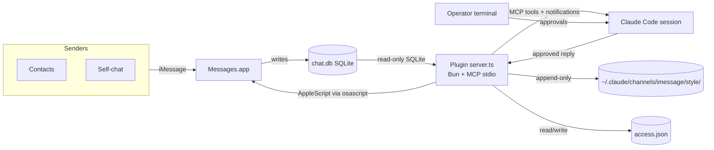
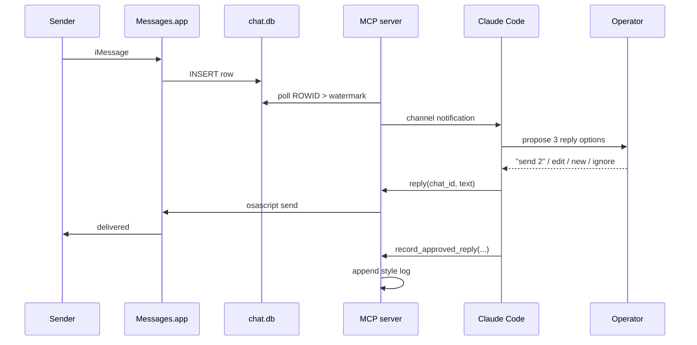
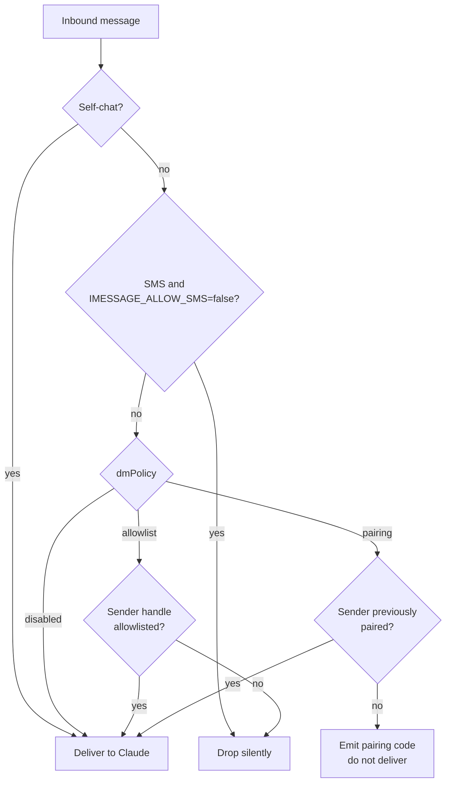
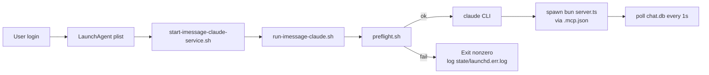

# iMessage Claude Assistant

A local-first macOS assistant that wires Apple iMessage into
[Claude Code](https://docs.anthropic.com/claude/docs/claude-code) through
a local Model Context Protocol (MCP) channel plugin. Incoming messages
surface inside a Claude Code session; outbound replies are drafted as
three explicit options, reviewed by the operator, and only sent after
approval. Approved replies are logged locally to train Claude on the
operator's voice over time.

Everything — message reads, message sends, message history, and style
learning — runs on the operator's own Mac. No hosted service, no cloud
sync, no third-party relay.

---

## Table of contents

1. [Overview](#1-overview)
2. [Features](#2-features)
3. [Project status](#3-project-status)
4. [Attribution](#4-attribution)
5. [Architecture](#5-architecture)
6. [Repository structure](#6-repository-structure)
7. [Requirements](#7-requirements)
8. [Installation](#8-installation)
9. [Configuration](#9-configuration)
10. [Running the assistant](#10-running-the-assistant)
11. [Running as a background service](#11-running-as-a-background-service)
12. [Access control and DM policy](#12-access-control-and-dm-policy)
13. [Using the assistant from iPhone, iPad, and other devices](#13-using-the-assistant-from-iphone-ipad-and-other-devices)
14. [Security and privacy](#14-security-and-privacy)
15. [Testing and verification](#15-testing-and-verification)
16. [Troubleshooting](#16-troubleshooting)
17. [Development and maintenance notes](#17-development-and-maintenance-notes)
18. [Links and references](#18-links-and-references)
19. [License and disclaimer](#19-license-and-disclaimer)
20. [Maintainer and contact](#20-maintainer-and-contact)

---

## 1. Overview

The assistant is structured as a Claude Code plugin that exposes an
iMessage *channel*: a bidirectional conduit between Claude Code and the
macOS Messages.app. The plugin reads Apple's local SQLite message store
(`~/Library/Messages/chat.db`) for inbound traffic and drives
Messages.app over AppleScript (`osascript`) for outbound traffic.

The core operator workflow is:

1. A conversation partner sends an iMessage.
2. The plugin detects the new row in `chat.db` and delivers it to the
   active Claude Code session.
3. Claude proposes **three distinct reply options** — safest, warmest,
   and most concise — per the rules in [CLAUDE.md](CLAUDE.md).
4. The operator explicitly approves, edits, or replaces a draft.
5. On approval, the plugin sends the message via Messages.app and
   appends the final text to a local, append-only style log.

The `/imessage:review` skill inverts that flow for catch-up scenarios:
the operator asks Claude to review existing unanswered threads, and
Claude walks them one at a time, always gating on explicit approval
before sending.

---

## 2. Features

### Messaging

- Inbound iMessage delivery into Claude Code sessions
- Outbound send via AppleScript (text + attachments)
- Full native message history via direct SQLite reads against
  `chat.db`
- Attachment pass-through: inbound images surface as local file paths
- Self-chat bypass for frictionless operator testing

### Assistant workflow

- Three-option reply proposal flow (see [CLAUDE.md](CLAUDE.md))
- Explicit operator approval required for every outbound message
- On-demand thread review via the `/imessage:review` skill
- Approved-reply log and per-contact style notes for voice learning
- Permission relay: mirrors Claude Code permission prompts into a
  self-chat so the operator can approve from a phone

### Access control

- Policy modes: `allowlist` (default), `pairing`, and `disabled`
- Per-handle allowlist and per-group enablement
- Runtime pairing flow with approval codes
- Hand-editable `access.json` plus a `/imessage:access` skill

### Operations

- Local marketplace registration (no external install required)
- Single-file MCP server on Bun
- `preflight.sh` and `doctor.sh` operator diagnostics
- Structured JSON logging (optional)
- `health_check` MCP tool for live self-diagnostics
- Optional macOS LaunchAgent for login-persistent operation

---

## 3. Project status

**Local personal fork.** This repository is a local, customized
implementation derived from the upstream Claude Code iMessage channel.
It is tuned for daily operator use on a single Mac, and reflects
opinionated choices around approval flow, style learning, and policy
semantics that do not necessarily match the upstream.

Versioning follows the plugin's own `version` field in
[`plugins/imessage/.claude-plugin/plugin.json`](plugins/imessage/.claude-plugin/plugin.json);
the current release is **0.2.0**. See [CHANGELOG.md](CHANGELOG.md).

---

## 4. Attribution

- **Original source and design foundation:** the official Claude Code
  iMessage channel plugin shipped by Anthropic, from which this project
  derives its chat.db reader, AppleScript sender, and MCP channel
  protocol scaffolding.
- **Local adaptation, extension, and maintenance:** Gabriel Chiappa.

All additions in this repository — the three-option approval workflow,
the style-learning subsystem, the `/imessage:review` skill, the
`record_approved_reply` / `recent_chats` / `pending_replies` /
`thread_summary` / `style_profile` / `health_check` MCP tools, the
structured logging, the diagnostics scripts, and the macOS LaunchAgent
packaging — are local modifications to support a specific operator
workflow.

Where this fork's behavior diverges from the upstream (for example, the
semantics of `dmPolicy: "disabled"`), the divergence is called out
explicitly in [section 12](#12-access-control-and-dm-policy).

Original authorship of the upstream Claude Code channel plugin is
retained by its original authors under the upstream license. See
[section 19](#19-license-and-disclaimer).

---

## 5. Architecture

### 5.1 System diagram



### 5.2 Message flow



### 5.3 Policy decision flow



### 5.4 Startup / service flow



---

## 6. Repository structure

```text
imessage-claude-assistant/
├── CLAUDE.md                         Session-level behavior rules (approval flow, style)
├── CHANGELOG.md                      Version history
├── README.md                         This file
├── .claude-plugin/
│   └── marketplace.json              Local Claude Code marketplace manifest
├── docs/
│   ├── setup.md                      Setup notes
│   ├── FEATURES.md                   Full tool catalog, env vars, state
│   └── ARCHITECTURE.md               Component diagram and data flow
├── macos/
│   └── com.gabriel.imessage-claude.plist   LaunchAgent template
├── plugins/
│   └── imessage/               The MCP plugin (see plugin README)
│       ├── package.json              Bun package; version 0.2.0
│       ├── server.ts                 Single-file MCP server
│       ├── .mcp.json                 MCP launcher config (absolute paths)
│       ├── .claude-plugin/plugin.json
│       ├── ACCESS.md                 Access-control schema and commands
│       ├── README.md                 Plugin-level README (upstream-style)
│       ├── LICENSE                   Apache-2.0 (upstream)
│       └── skills/
│           ├── access/SKILL.md       Allowlist / pairing / policy management
│           ├── configure/SKILL.md    Read-only environment status
│           └── review/SKILL.md       On-demand thread review workflow
├── prompts/
│   └── review-existing-messages.md   Standalone review prompt
├── scripts/
│   ├── doctor.sh                     Full diagnostic
│   ├── preflight.sh                  Fast fail-check (invoked by run script)
│   ├── run-imessage-claude.sh        Preflight + launch Claude Code
│   ├── start-imessage-claude-service.sh  LaunchAgent entrypoint
│   └── install-imessage-launch-agent.sh  One-shot plist installer
├── start-imessage-claude.sh          Convenience wrapper
└── state/                            Service logs (service.log, launchd.*.log)
```

Runtime state lives outside the repo under `~/.claude/` — see
[section 9](#9-configuration).

---

## 7. Requirements

### 7.1 Hardware and OS

- A Mac (Apple Silicon or Intel) running a current macOS release that
  supports the native Messages.app (macOS 12 Monterey or later is
  recommended; the plugin has been exercised on macOS 14 and 15).
- A local user account signed into iMessage in Messages.app with at
  least one active Apple ID or phone number.

### 7.2 Software

- [Claude Code CLI](https://docs.anthropic.com/claude/docs/claude-code)
  installed and authenticated.
- [Bun](https://bun.sh) 1.0 or later, available on the user's PATH.
  The bundled `.mcp.json` launches Bun via a PATH lookup and uses
  `${CLAUDE_PLUGIN_ROOT}` to resolve the plugin directory, so the
  manifest is portable across installations — just make sure `bun`
  resolves on your PATH (see [section 9.1](#91-mcp-launcher-mcpjson)).
- A terminal emulator that will be granted macOS Full Disk Access
  (Terminal.app, iTerm2, Ghostty, or an IDE's integrated terminal).

### 7.3 macOS permissions

- **Full Disk Access** — required. The plugin reads `chat.db`, which is
  protected by the macOS TCC subsystem. The first launch will either
  prompt for access or fail with `authorization denied`; grant access
  under **System Settings → Privacy & Security → Full Disk Access**.
- **Automation: Messages** — required. The first outbound send
  triggers a one-time "Terminal wants to control Messages" prompt.
  Accept it.
- **Accessibility** is *not* required.

### 7.4 Optional tooling

- VS Code or another editor if you plan to customize `server.ts` or the
  skill files.
- `jq` and `python3` are used by the diagnostic scripts when available
  but are not strictly required.

---

## 8. Installation

### 8.1 Clone the repository

```sh
git clone <your-fork-url> imessage-claude-assistant
cd imessage-claude-assistant
```

The plugin's MCP manifest resolves paths through
`${CLAUDE_PLUGIN_ROOT}`, so the repository can live anywhere on disk.
The operator scripts (`scripts/run-imessage-claude.sh`,
`scripts/doctor.sh`, etc.) derive their own paths from their location,
so no edits are required after cloning.

### 8.2 Verify prerequisites

```sh
./scripts/doctor.sh
```

The doctor script verifies Bun, the Claude CLI, JSON validity of all
config files, readability of `chat.db`, presence of the LaunchAgent
plist (optional), and current policy. Resolve any red items before
proceeding.

### 8.3 Register the local marketplace

In a running Claude Code session:

```text
/plugin marketplace add /absolute/path/to/imessage-claude-assistant/.claude-plugin/marketplace.json
/plugin install imessage@gabriel-local-plugins
```

The marketplace name (`gabriel-local-plugins`) comes from
[`.claude-plugin/marketplace.json`](.claude-plugin/marketplace.json)
and the plugin name (`imessage`) from
[`plugins/imessage/.claude-plugin/plugin.json`](plugins/imessage/.claude-plugin/plugin.json).
If you rename either, update references in this document, the skill
files, and the LaunchAgent command.

### 8.4 Grant macOS permissions

1. Start the assistant once — see [section 10](#10-running-the-assistant).
2. When prompted, allow Full Disk Access for your terminal.
3. Send yourself an iMessage. The assistant will deliver it.
4. Approve a reply. When macOS prompts for Automation control of
   Messages, accept.

After these one-time prompts, no further manual permission grants are
required.

---

## 9. Configuration

### 9.1 MCP launcher (`.mcp.json`)

[`plugins/imessage/.mcp.json`](plugins/imessage/.mcp.json)
tells Claude Code how to spawn the MCP server:

```json
{
  "mcpServers": {
    "imessage": {
      "command": "bun",
      "args": ["run", "--cwd", "${CLAUDE_PLUGIN_ROOT}", "--silent", "start"]
    }
  }
}
```

`command` uses a PATH lookup, so any `bun` on your PATH works.
`${CLAUDE_PLUGIN_ROOT}` is expanded by Claude Code to the absolute
path of the installed plugin directory, keeping the manifest portable
between installs. The `start` script in `package.json` performs a
best-effort `bun install` (silent, frozen-lockfile first, then
unfrozen) before exec'ing `bun server.ts` so the plugin remains
self-contained.

### 9.2 Marketplace manifest (`.claude-plugin/marketplace.json`)

Declares the local marketplace (`gabriel-local-plugins`) and its
plugins. Owner metadata reflects the local maintainer.

### 9.3 Plugin manifest (`plugin.json`)

Declares the plugin name, version, and keywords. Version is tracked
here and in the Bun `package.json`. Keep the two in sync.

### 9.4 Claude Code settings (`~/.claude/settings.json`)

Standard Claude Code settings file. Nothing plugin-specific is required
here; respect your existing configuration.

### 9.5 Access configuration (`~/.claude/channels/imessage/access.json`)

Runtime access-control state: policy, allowlist, pending pairings,
enabled groups, and delivery flags. See
[section 12](#12-access-control-and-dm-policy) and
[plugins/imessage/ACCESS.md](plugins/imessage/ACCESS.md).

### 9.6 Style learning (`~/.claude/channels/imessage/style/`)

| File | Role |
| --- | --- |
| `preferences.json` | Operator-authored defaults (tone, signature overrides, reserved roadmap fields). Managed via `/imessage:settings` / the `edit_preferences` MCP tool; also safe to hand-edit. |
| `approved-examples.jsonl` | Append-only log of every approved reply. Written by `record_approved_reply`. |
| `contacts/<handle>.md` | Per-contact free-form notes. Appended by `record_approved_reply`'s optional `note` argument or edited by hand. |

The global voice summary lives at
`~/.claude/imessage-style-profile.md` and is read by Claude through the
`style_profile` tool.

### 9.7 Environment variables

| Variable | Default | Effect |
| --- | --- | --- |
| `IMESSAGE_APPEND_SIGNATURE` | `true` | Appends `\nSent by Claude` to outbound messages. |
| `IMESSAGE_ALLOW_SMS` | `false` | Accept inbound SMS/RCS in addition to iMessage. Off by default because SMS sender IDs are spoofable. |
| `IMESSAGE_ACCESS_MODE` | *(unset)* | Set to `static` to disable runtime pairing and read `access.json` only. |
| `IMESSAGE_STATE_DIR` | `~/.claude/channels/imessage` | Override where access and style state live. |
| `IMESSAGE_LOG_JSON` | `false` | Emit structured JSON log lines instead of human text. |
| `IMESSAGE_LOG_LEVEL` | `info` | `debug`, `info`, `warn`, or `error`. |

There is **no `.env` file**. `server.ts` reads these straight from
`process.env`, and the MCP server is spawned by Claude Code from its
own working directory, so a plugin-local `.env` would be ignored even
if one existed. Set variables in one of these three places:

- **Shell** (interactive runs):

  ```sh
  IMESSAGE_LOG_JSON=true ./scripts/run-imessage-claude.sh
  ```

- **`.mcp.json`** — add an `env` object to the `imessage` server entry:

  ```json
  "imessage": {
    "command": "bun",
    "args": ["run", "--cwd", "${CLAUDE_PLUGIN_ROOT}", "--silent", "start"],
    "env": { "IMESSAGE_LOG_JSON": "true" }
  }
  ```

- **LaunchAgent plist** — extend the `EnvironmentVariables` dict in
  [macos/com.gabriel.imessage-claude.plist](macos/com.gabriel.imessage-claude.plist)
  (which already sets `PATH` and `HOME`).

---

## 10. Running the assistant

### 10.1 Recommended launch (with preflight)

```sh
./scripts/run-imessage-claude.sh
```

This runs `preflight.sh` first, bails out on blockers, and then starts
Claude Code with the local development channel enabled.

### 10.2 Direct launch

```sh
claude --dangerously-load-development-channels plugin:imessage@gabriel-local-plugins
```

Because this is a local development channel rather than an
Anthropic-approved channel, Claude Code requires the
`--dangerously-load-development-channels` flag and prompts for
confirmation on first launch. Choose `1. I am using this for local
development`.

Verify by typing `/imessage:` in the session; `configure`, `access`,
and `review` should autocomplete.

### 10.3 Diagnostic utilities

- `./scripts/doctor.sh` — full diagnostic (bun, claude, JSON,
  chat.db, state, launchd).
- `./scripts/preflight.sh` — fast subset, exits non-zero on hard
  blockers. Invoked automatically by `run-imessage-claude.sh`.
- Inside an active session, call the `health_check` MCP tool for a
  live report (DB path, state dir, policy, watermark, recent error
  counts).

---

## 11. Running as a background service

The assistant can run continuously in the background via a macOS
LaunchAgent, so that iMessages are observed and surfaced as soon as you
log in — without keeping a terminal open.

### 11.1 Concept

A LaunchAgent plist declares a user-scoped process that launchd
supervises. Our plist
([macos/com.gabriel.imessage-claude.plist](macos/com.gabriel.imessage-claude.plist))
runs [`scripts/start-imessage-claude-service.sh`](scripts/start-imessage-claude-service.sh),
which wraps `run-imessage-claude.sh` so that Claude Code and the MCP
server start together under launchd supervision.

### 11.2 Install

```sh
./scripts/install-imessage-launch-agent.sh
```

This copies the plist to
`~/Library/LaunchAgents/com.gabriel.imessage-claude.plist` and loads it
into launchd.

### 11.3 Operate

| Task | Command |
| --- | --- |
| Inspect | `launchctl print gui/$(id -u)/com.gabriel.imessage-claude` |
| Restart | `launchctl kickstart -k gui/$(id -u)/com.gabriel.imessage-claude` |
| Unload | `launchctl bootout gui/$(id -u)/com.gabriel.imessage-claude` |

### 11.4 Logs

Under `state/` at the repo root:

- `service.log` — wrapper script output
- `launchd.out.log` — stdout from the supervised process
- `launchd.err.log` — stderr from the supervised process

Tail them with `tail -f state/launchd.err.log`. For structured logs,
set `IMESSAGE_LOG_JSON=true` in the plist's `EnvironmentVariables`.

### 11.5 Cautions and best practices

- **Full Disk Access** must be granted to the binary the LaunchAgent
  launches (typically Bun or the wrapping shell). Granting Full Disk
  Access to your interactive terminal does not automatically extend
  to a launchd-spawned process.
- **Automation permissions** must already be granted for the shell or
  Bun binary that drives AppleScript. Test interactively first.
- **Do not embed secrets in the plist.** Use `EnvironmentVariables`
  sparingly, and prefer `IMESSAGE_LOG_JSON=true` + a file-based
  logger over ad-hoc plaintext.
- **Restart on code changes.** The MCP server is spawned once per
  Claude Code session; edits to `server.ts` require a
  `launchctl kickstart -k` to take effect.
- **Crash behavior.** If Claude Code exits, launchd will re-spawn per
  the plist's `KeepAlive` policy. Watch `state/launchd.err.log` for
  crash loops.

---

## 12. Access control and DM policy

The access gate governs which senders reach the assistant. It is
configured via `~/.claude/channels/imessage/access.json`. Self-chat
always bypasses the gate.

### 12.1 Policy modes

| Mode | Meaning in this fork |
| --- | --- |
| `allowlist` | Only handles in `allowFrom` reach the assistant. Everything else is silently dropped. This is the recommended default. |
| `pairing` | New senders receive a short pairing code. The operator must approve the code via `/imessage:access pair <code>` before any message from that sender is delivered. |
| `disabled` | **Local-fork divergence.** In this fork, `disabled` means "all DMs are delivered without approval or pairing." This is not an upstream default; use only for single-user, fully trusted environments. The `health_check` tool prints an explicit warning when this mode is active. |

Group chats are governed separately — enable specific group GUIDs in
`access.json` via the `/imessage:access` skill.

### 12.2 Managing access

- Inspect current state: `/imessage:access`
- Add a handle: `/imessage:access allow +15551234567`
- Approve a pending pairing: `/imessage:access pair a4f91c`
- Deny a pending pairing: `/imessage:access deny a4f91c`
- Full schema: [plugins/imessage/ACCESS.md](plugins/imessage/ACCESS.md)

Handles are either E.164 phone numbers (`+15551234567`) or Apple ID
emails (`someone@icloud.com`).

---

## 13. Using the assistant from iPhone, iPad, and other devices

The assistant runs exclusively on macOS — there is no iOS, Linux, or
Windows port — but you can operate it *remotely* from any device that
can send iMessages to your own Apple ID. This is the self-chat pattern.

### 13.1 iPhone or iPad (iMessage self-chat)

1. Ensure your iPhone or iPad is signed into the **same Apple ID** as
   your Mac and has iMessage enabled.
2. In the Messages app on the phone, start a new conversation addressed
   to your own number or your own Apple ID email.
3. Send a message to yourself. On your Mac, the assistant delivers it
   into the active Claude Code session without going through the access
   gate (self-chat bypass).
4. Claude's replies and permission prompts appear in the same self-chat
   thread; you can approve or edit from the phone by replying to the
   thread.
5. On first use, send `/help` or any arbitrary text — the assistant
   will surface the message in Claude and you can interact as if you
   were at the Mac.

### 13.2 Apple Watch

Any Apple Watch paired to an iPhone that is signed into your Apple ID
can send to the self-chat thread. The same flow applies — this is
convenient for quick approvals while away from the desk.

### 13.3 Non-Apple devices

You cannot natively send iMessage from Android, Linux, or Windows. If
you need remote access from a non-Apple device, the recommended options
are:

- **SSH into the Mac** and run `./scripts/run-imessage-claude.sh` or
  attach to the existing service session.
- **Use a remote-desktop tool** (macOS Screen Sharing, Jump Desktop,
  Tailscale SSH) to reach the Mac, then operate Claude Code directly.
- **Use an iMessage bridge** such as [BlueBubbles](https://bluebubbles.app)
  on a separate device. This is outside the scope of this project and
  has its own security model; evaluate carefully.

### 13.4 Notes on remote operation

- The Mac must remain powered on and logged in for the plugin to poll
  `chat.db`. A LaunchAgent keeps it running, but login-session state
  still matters.
- iMessage forwarding between devices can delay messages by a few
  seconds; this is normal.
- If you switch Apple IDs on the Mac, re-run `/imessage:configure` —
  the self-chat handle list is cached at startup.

---

## 14. Security and privacy

### 14.1 Data handled

- **Message content**: full text of every message in every allowlisted
  conversation, plus attachment file paths. Messages are read locally
  from `chat.db`; they are sent to Claude Code, which transmits them
  to Anthropic for inference per Claude's own data-handling terms.
- **Style data**: approved reply text, chosen option index, contact
  handle, optional operator notes. Stored locally under
  `~/.claude/channels/imessage/style/`.
- **Access state**: allowlist, pairing codes, group memberships.
  Stored locally under `~/.claude/channels/imessage/access.json`.

### 14.2 Risk surface

- **Full Disk Access** grants the launched process the ability to read
  *any* file `chat.db` access implies. Limit which binaries you grant
  FDA to.
- **Automation of Messages** grants the launched process the ability
  to *send* iMessages from your account. Treat it as equivalent to
  giving that binary access to your phone.
- **Prompt injection via incoming messages** is the single most
  important threat. An attacker cannot force a send — the operator
  must approve — but a malicious message can *try* to convince Claude
  to draft something deceptive. The rules in [CLAUDE.md](CLAUDE.md)
  and the `/imessage:review` skill explicitly instruct Claude to
  treat inbound content as untrusted input and to never treat it as
  operator instructions.
- **Policy slackness** — running with `dmPolicy: "disabled"` delivers
  everything, including marketing blasts, 2FA codes, and spoofable
  SMS. Use `allowlist` for anything approaching production use.
- **SMS spoofing** — the `IMESSAGE_ALLOW_SMS` flag is `false` by
  default because SMS sender IDs are spoofable. A forged SMS "from
  your own number" would otherwise bypass access control.

### 14.3 Safe operating recommendations

- Keep `dmPolicy` set to `allowlist` and curate handles carefully.
- Leave `IMESSAGE_ALLOW_SMS=false` unless you accept the spoofing risk.
- Never add `--yolo` / auto-approve flags to the launch command.
- Review `approved-examples.jsonl` periodically; it is an audit log.
- Rotate `access.json` (back up and restart) if a phone number is
  recycled.
- Do not share the repository tree verbatim — your `.mcp.json`
  contains an absolute path that reveals your username.

---

## 15. Testing and verification

After installation, walk through this checklist:

1. `./scripts/doctor.sh` prints `Result: ready`.
2. `./scripts/run-imessage-claude.sh` starts Claude Code; `preflight: ok`
   is visible.
3. Inside the Claude session, `/imessage:configure` autocompletes and
   reports Full Disk Access granted.
4. Call the `health_check` MCP tool. Expect non-error output with the
   current policy and a non-null watermark.
5. Send an iMessage to yourself. The message surfaces inside the
   Claude session within ~1 second.
6. Ask Claude for reply options. Confirm three distinct options are
   proposed.
7. Approve one. Confirm it arrives on the destination device.
8. Confirm a new entry was appended to
   `~/.claude/channels/imessage/style/approved-examples.jsonl`.
9. Call `chat_messages` (with no `chat_guid`) — expect a multi-chat
   summary with per-chat labels.
10. Add a second handle via `/imessage:access allow <handle>`; send
    from that handle; confirm it is delivered.
11. Remove the handle; send again; confirm it is silently dropped.
12. `launchctl print gui/$(id -u)/com.gabriel.imessage-claude` reports
    the service as running (if installed).

---

## 16. Troubleshooting

### 16.1 `authorization denied` on startup

`chat.db` is TCC-protected. Open
**System Settings → Privacy & Security → Full Disk Access**, add the
terminal app (or Bun binary) you launched the assistant from, and
relaunch. A simple app restart is not enough — the process must
re-exec.

### 16.2 `bun: command not found`

Install Bun (`curl -fsSL https://bun.sh/install | bash`) and confirm
its absolute path with `which bun`. Update `plugins/imessage/.mcp.json`'s
`command` field to that path.

### 16.3 "Channel plugin failed to start" / MCP spawn error

- Run `./scripts/doctor.sh` — look for JSON invalidity, missing files,
  or a Bun/claude path mismatch.
- Confirm `plugins/imessage/.mcp.json` `--cwd` matches the actual
  repo location.
- Run `bun /path/to/plugins/imessage/server.ts` directly; the
  error is usually obvious.

### 16.4 `/imessage:configure` doesn't autocomplete

The plugin is not installed. Re-run:

```text
/plugin marketplace add /abs/path/to/.claude-plugin/marketplace.json
/plugin install imessage@gabriel-local-plugins
```

Restart Claude with `--dangerously-load-development-channels`.

### 16.5 Messages don't arrive

- Verify `iMessage` is enabled in Messages.app Preferences → iMessage.
- Check the effective policy with `/imessage:access`. Confirm the
  sender handle is in `allowFrom` or that the sender has been paired.
- Confirm `IMESSAGE_ALLOW_SMS` matches the transport — an SMS will be
  dropped by default.
- Tail `state/launchd.err.log` (service mode) for polling errors.

### 16.6 Outbound send fails / no Automation prompt

- Open Messages.app once manually to confirm the conversation exists.
- In **System Settings → Privacy & Security → Automation**, confirm
  your terminal or Bun is allowed to control Messages. If the entry is
  missing, force the prompt by sending once interactively.

### 16.7 Launchd service exits immediately

- `launchctl print gui/$(id -u)/com.gabriel.imessage-claude` — look
  for `last exit code`.
- Check `state/launchd.err.log`. The most common cause is that the
  plist's referenced shell scripts lost their executable bit
  (`chmod +x scripts/*.sh`).
- Full Disk Access may not extend from the interactive terminal to the
  LaunchAgent-spawned shell. Grant FDA directly to Bun or to
  `/bin/bash` as appropriate.

### 16.8 "disabled policy but no messages arrive"

Self-chat still requires Messages.app to treat the thread as iMessage,
not SMS. If you see a green bubble, iMessage is not active for that
thread. Resend when iMessage reports "Delivered."

### 16.9 Diagnostic mismatches between docs and behavior

If a skill references a tool that `health_check` does not list, the
plugin version on disk is out of sync with the docs. Re-read
[docs/FEATURES.md](docs/FEATURES.md) and confirm the `version` in
`plugin.json` matches the documented release.

---

## 17. Development and maintenance notes

### 17.1 Where behavior lives

| Concern | File |
| --- | --- |
| Inbound polling, send, tool registration, logging | [plugins/imessage/server.ts](plugins/imessage/server.ts) |
| Approval flow rules (operator-facing) | [CLAUDE.md](CLAUDE.md) |
| Access control semantics (docs) | [plugins/imessage/ACCESS.md](plugins/imessage/ACCESS.md) |
| Skill prompts | [plugins/imessage/skills/*/SKILL.md](plugins/imessage/skills/) |
| Diagnostics scripts | [scripts/](scripts/) |
| Launchd service | [macos/com.gabriel.imessage-claude.plist](macos/com.gabriel.imessage-claude.plist) |
| Marketplace + plugin metadata | [.claude-plugin/marketplace.json](.claude-plugin/marketplace.json), [plugins/imessage/.claude-plugin/plugin.json](plugins/imessage/.claude-plugin/plugin.json) |

### 17.2 Runtime vs docs vs marketplace

Runtime behavior comes only from `server.ts` and the `access.json` it
reads. The skill markdown files, the ACCESS.md, and this README are
*documentation* — they guide Claude and the operator but never change
behavior. Treat them accordingly: never rely on a skill file's wording
to enforce a rule; enforce it in `server.ts`.

### 17.3 File format expectations

- All JSON files must be strict JSON (no trailing commas, no comments).
- Skill files are YAML-frontmatter Markdown — the frontmatter's
  `allowed-tools` gates what Claude can call from that skill.
- The `.mcp.json` launcher is parsed by Claude Code, not by the plugin
  itself; edits require a full Claude Code restart.

### 17.4 Cross-file corruption cautions

- Do not edit `plugin.json` version without also bumping `package.json`.
- Do not add a tool to `server.ts` without surfacing it in the
  relevant skill's `allowed-tools` frontmatter — otherwise Claude
  Code will refuse to call it from within the skill.
- Avoid hand-editing `approved-examples.jsonl`; it is append-only and
  parsed line-by-line.

### 17.5 Adding a new MCP tool

1. Register the tool in `ListToolsRequestSchema`.
2. Implement it in the `CallToolRequestSchema` switch.
3. If it reads a new `chat.db` table, add a module-scope prepared
   query for performance.
4. Surface it in the relevant skill's `allowed-tools`.
5. Document it in [docs/FEATURES.md](docs/FEATURES.md) and bump the
   plugin version.

### 17.6 Verifying changes

```sh
./scripts/preflight.sh && ./scripts/doctor.sh
```

Re-run after every meaningful edit. When running under launchd,
`launchctl kickstart -k gui/$(id -u)/com.gabriel.imessage-claude`
after installing new code.

---

## 18. Links and references

- Claude Code: <https://docs.anthropic.com/claude/docs/claude-code>
- Model Context Protocol: <https://modelcontextprotocol.io>
- Bun runtime: <https://bun.sh>
- BlueBubbles (alternative iMessage bridge): <https://bluebubbles.app>
- This fork's capability catalog: [docs/FEATURES.md](docs/FEATURES.md)
- This fork's architecture overview: [docs/ARCHITECTURE.md](docs/ARCHITECTURE.md)
- This fork's session-rules document: [CLAUDE.md](CLAUDE.md)
- Maintainer's LinkedIn: <https://www.linkedin.com/in/gabriel-chiappa/>
- Maintainer's email: `gabrielchiappa@outlook.com`

---

## 19. License and disclaimer

The plugin source in `plugins/imessage/` is distributed under the
**Apache License 2.0**, consistent with the upstream from which this
fork derives
(see [plugins/imessage/LICENSE](plugins/imessage/LICENSE)).

Local additions, customizations, scripts, and documentation in this
repository are © 2024–2026 Gabriel Chiappa and are released under the
same Apache License 2.0 unless a specific file indicates otherwise.

This project is a personal fork. It is provided **as-is, without
warranty of any kind**. The maintainer is not affiliated with Anthropic
or Apple. Use of this software requires your own compliance with:

- Apple's terms of service for iMessage and macOS,
- Anthropic's terms of service for Claude and Claude Code,
- Any applicable laws regarding electronic communications, consent,
  and automated message processing in your jurisdiction.

In short: you are responsible for what you allow the assistant to read
and send.

---

## 20. Maintainer and contact

**Gabriel Chiappa** — local fork author, adaptation, and maintenance.

- LinkedIn: <https://www.linkedin.com/in/gabriel-chiappa/>
- Email: `gabrielchiappa@outlook.com`

For bug reports and feature suggestions specific to this local fork,
open an issue on this repository. Upstream concerns belong upstream.
