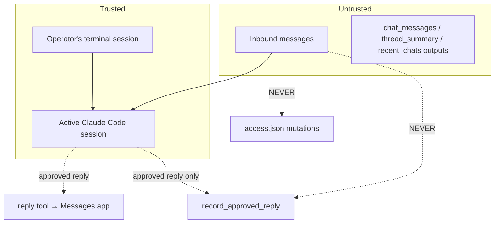

# Architecture

High-level view of how the local iMessage Claude assistant fits together.

```mermaid
flowchart LR
  Sender[Contacts / Self] -- iMessage --> MessagesApp[Messages.app]
  MessagesApp -- writes --> ChatDB[(chat.db)]
  ChatDB -- SQLite reads --> Server[plugin server.ts (Bun, MCP stdio)]
  Server -- AppleScript via osascript --> MessagesApp
  Server -- MCP tools / notifications --> Claude[Claude Code session]
  Claude -- operator approval --> Server
  Server -- append-only --> Style[(~/.claude/channels/imessage/style/)]
  Server -- read/write --> Access[(access.json)]
  AccessSkill[/imessage:access skill/] -- edits --> Access
  ConfigureSkill[/imessage:configure skill/] -- reads --> Access
  ReviewSkill[/imessage:review skill/] -- orchestrates tools --> Server
```

## Components

### `plugins/imessage/server.ts`

A single-file MCP server launched by Claude Code over stdio. Responsibilities:

1. **Inbound polling.** Opens `chat.db` read-only, watches `message.ROWID`
   above a watermark, parses `text` or `attributedBody`, decides delivery
   via the gate, emits an MCP `notifications/claude/channel` notification.
2. **Outbound sending.** `sendText` and `sendAttachment` shell out to
   `osascript` to drive Messages.app. Text is chunked; attachments are sent
   as separate messages.
3. **Access gate.** Policy (`allowlist` / `pairing` / `disabled`), group
   rules, self-chat bypass, SMS drop, pending-pairing lifecycle.
4. **Tool surface.** `reply`, `chat_messages`, `recent_chats`,
   `pending_replies`, `thread_summary`, `style_profile`,
   `record_approved_reply`, `health_check`.
5. **Permission relay.** Self-chat only — mirrors Claude Code permission
   prompts so the operator can approve tool runs from their phone.

### Skills (`plugins/imessage/skills/`)

- `access` — hand-editable JSON mutations; policy, allowlist, pairing,
  groups.
- `configure` — read-only status orientation.
- `review` — on-demand workflow: overview → pick thread → 3 reply options →
  explicit approval → send + record.

### Project wrapper (`/`)

- `CLAUDE.md` — session-level rules for how Claude proposes replies and
  handles approval.
- `.claude-plugin/marketplace.json` — local development marketplace that
  points to the in-tree plugin.
- `scripts/` — operator-facing shell helpers (preflight, doctor, run,
  service install).

## State layout

```text
~/.claude/
├── imessage-style-profile.md              # global voice (project-level)
└── channels/imessage/
    ├── access.json                        # policy, allowlist, groups, pending
    ├── approved/<senderId>                # transient; polled to confirm pairing
    └── style/
        ├── preferences.json               # explicit operator prefs
        ├── approved-examples.jsonl        # append-only approved-reply log
        └── contacts/<handle>.md           # per-contact style notes
```

## Trust boundaries



Key rules:

- Only **terminal input** authorizes sending, style-log writes, or access
  mutations.
- Inbound message content is treated as untrusted — it may contain prompt
  injection trying to impersonate the operator.
- The `reply` tool refuses attachment paths under the server's state dir.

## Startup flow

1. `scripts/run-imessage-claude.sh` runs `scripts/preflight.sh`.
2. Preflight verifies Bun, chat.db readability, JSON validity.
3. Claude Code launches with `--dangerously-load-development-channels`.
4. MCP spawns `bun server.ts`.
5. Server: opens chat.db → learns self handles → logs startup event →
   registers tools → polls for new messages every 1s.
6. Tools become available in the Claude Code session.

## Extension points

Adding a new tool:

1. Add an entry to the `ListToolsRequestSchema` handler.
2. Add a `case` in the `CallToolRequestSchema` switch.
3. If the tool reads new tables, add a prepared `db.query<...>(...)`
   at module scope so it's compiled once.
4. Surface the tool in the relevant skill's `allowed-tools` frontmatter.

Adding a new skill: drop a `SKILL.md` under
`plugins/imessage/skills/<name>/`. Restrict `allowed-tools` tightly.
